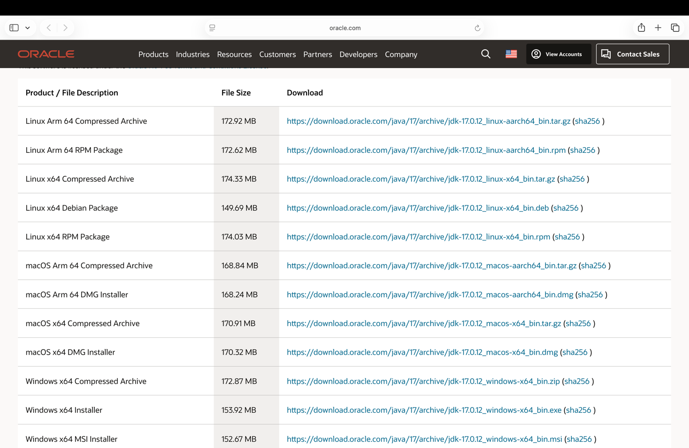
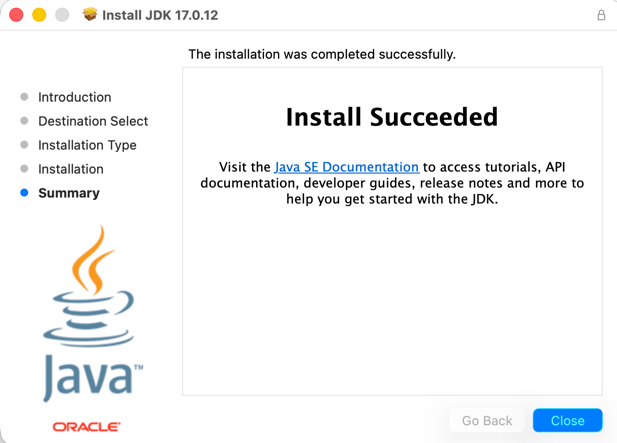
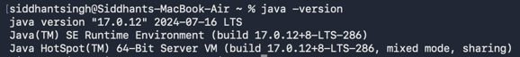
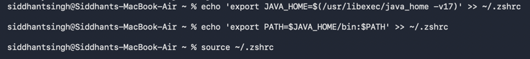

## Install & Configure Java (JDK/JRE)

### 1. Install JDK 

Download the latest LTS version of Java (JDK 17 recommended):

- Oracle JDK: https://www.oracle.com/java/technologies/downloads/

Choose your OS:
- Windows
- Mac
- Linux

---

### 2. Run Installer

Follow installation steps:
- Click on Continue
- Install
- Enter password
- Close

---

### 3. Verify Installation 

Open terminal and run:

`java -version`

---
### 3. Set JAVA_HOME

Setting up JAVA_HOME

`echo 'export JAVA_HOME=$(/usr/libexec/java_home -v17)' >> ~/.zshrc`

`echo 'export PATH=$JAVA_HOME/bin:$PATH' >> ~/.zshrc`

`source ~/.zshrc`

---
### 4.Confirm Java Path

`echo $JAVA_HOME`

